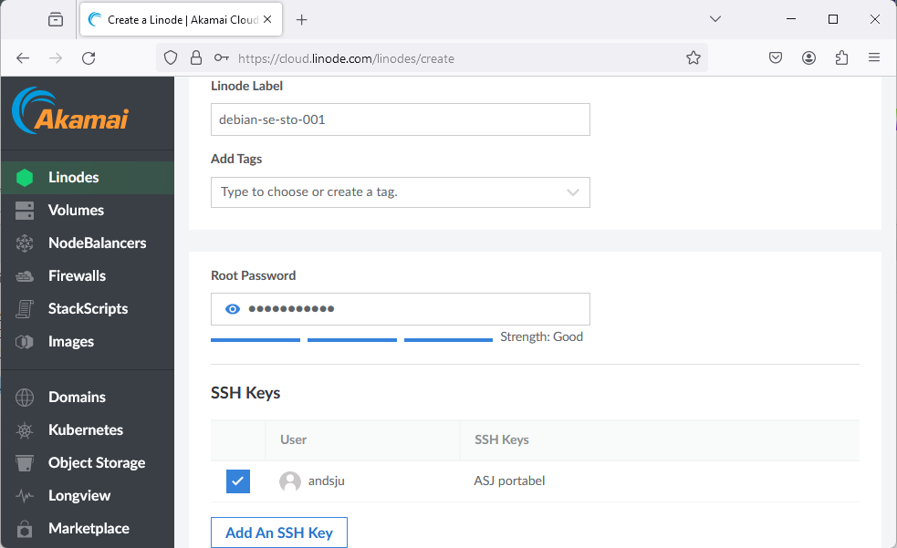

# Linode-NodeApp

A tutorial showing how to setup a Node.js application in Linode (Debian 12 server). 

Login using your Linode account. If you don´t have account - create one.

## Setup a Debian server

Create a Linode (https://www.linode.com/) Debian 12 server. Follow the gudie and choose to create a simple server at a region nearby. Set a password for the account *root*. 

Some screenshots:

#### Choose image: Debian 12

#### Choose a nearby region and a shared CPU

#### Set root password

#### Wait (provisioning) until server is up


The server will be spin up after some while. Check for status "Running".

Open Visual Studio Code and the a terminal. Run a command to login to the server using ssh. You can copy the login command - see *SSH Access* in the created Linode server. 


Login using ssh and the password

```bash
ssh root@172.232.157.64
```


Command to check your current folder in Debian

```bash
pwd
```

Update and upgrade the server (cmd switch `-y` auto confirms). 

```bash
apt-get update -y
apt-get upgrade -y
```

Install Node.js

```bash
apt-get install nodejs -y
nodejs --version
```

Displaying the version will show something like *18.* or simmilar.


Install Node Packet Manager: npm 

```bash
apt-get install npm -y
npm --version
```

Displaying the version will show something like *9.* or simmilar.


Create an application folder - like a folder named *nodeapp*. 
This folder can be created in another folder than parent root directory - but this is fine for a simple test application.


```bash
mkdir nodeapp
cd nodeapp
```


Install Debain net tools - useful for checking application / troubleshooting.

```bash
apt-get install net-tools -y
```

If you have an existing local project, it´s time to transfer some files to the server. One way to transfer files and folders is to use ftp software, like FileZilla.


Transfer files from the application using FileZila (https://filezilla-project.org/).

When FileZilla is installed, set connection access rights to the Linode server.

Make sure you use correct protocol (sftp) and prompt for password. The user is the default account *root* in this tutorial.

#### Enter credentials

#### Enter password

#### List remote directories

#### Navigate local directory to find your application. 
Mark files and folders and transfer them to the remote server.

### Note: 

In a Node.js project you should **always avoid transfer a dependency folder** like *node_modules*. 


The file `package.json` is the key file to install the application on the remote side.


Now, switch to Visual Studio Code and install the project using *npm*. A folder *node_modules* will be created automatically.

```bash
npm install
```

Depending on settings in package.json, the method to spin up the server vill vary.

`package.json` example

```json
{
  "name": "wudwebsocketlab",
  "version": "1.0.0",
  "description": "",
  "main": "server.js",
  "type": "module",
  "scripts": {
    "test": "echo \"Error: no test specified\" && exit 1",
    "dev": "nodemon server"
  },
  "repository": {
    "type": "git",
    "url": "git+https://github.com/andsju/WUDWebSocketLab.git"
  },
  "author": "",
  "license": "ISC",
  "bugs": {
    "url": "https://github.com/andsju/WUDWebSocketLab/issues"
  },
  "homepage": "https://github.com/andsju/WUDWebSocketLab#readme",
  "dependencies": {
    "express": "^4.18.1",
    "uuid": "^9.0.0",
    "ws": "^8.8.1",
    "nodemon": "^3.0.1"
  }
}
```

Using the settings above, the server will start up using nodemon, following cmd:

```bash
npm run dev
```

---

If you want to edit files in remote Debian environment, you can use **nano - a text editor**. 

Enter the cmd *nano [file-name]*, like

```bash
nano server.js
```

This editor makes it possible to edit and save the file remote. It´s also possible to use FileZilla, right click a file and find the edit option.

---

### Check application from cmd prompt

Is the application running on a port? Use command *netstat* and the port number.

```bash
netstat -antup | grep 8081
```


Use `curl` to request page

```bash 
curl http://127.0.0.1:8081
```

If public folder exists (using express static folder), an existsing `index.html` file should show up (otherwise an error page) 


### Is client-side using a protocol like ws?

The client side script uses websockets. The servers IP adress and port must match. Creating a Linode server instance will give you an IP adress, like `172.232.157.137`.

**This must match the client side script.** An example - a browser using JavaScript to communicate using websocket protocol:  

```js
const url = "172.232.157.137"; 
const port = 8081;

const websocket = new WebSocket(`ws://${url}:${port}`);
```


Use a browser to navigate to the servers IP adress, ie 'http://172.232.157.137:8081/'


A websocket can handle many clients. Time to access url from different browsers - and since it´s a public server - different locations and not just your private network...!
